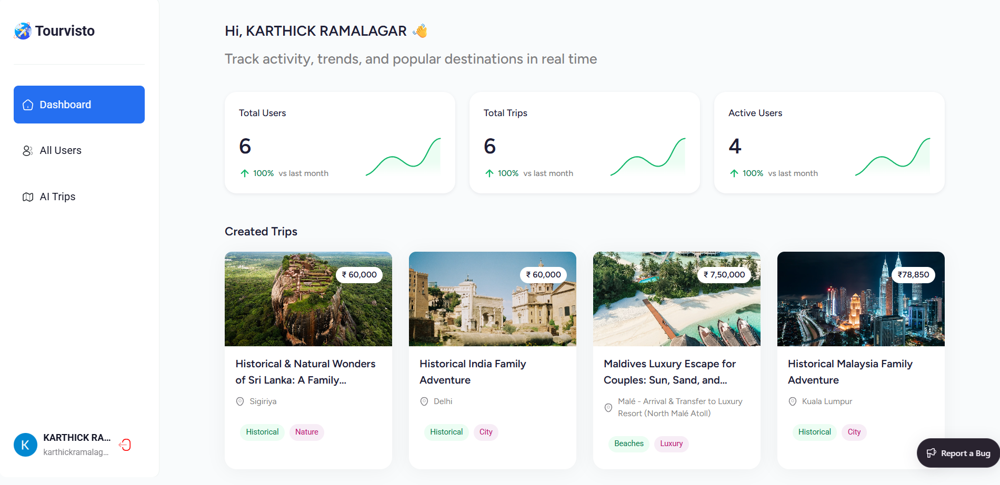

# 🌍 TrourVisto — AI Powered Travel Experience

<p align="center">
  
</p>

<div style="margin-top:10px">
  
  
  
  
  
  
  
  
</div>

<div align="center">
  <p>
<strong>TrourVisto</strong> is an AI-powered, full-stack travel application designed to eliminate the need for traditional travel agencies by connecting users directly to AI-driven itineraries, recommendations, and real-time travel assistance.
  </p>
  <p><a href="https://tourvisto-ai.vercel.app/#" target="_blank"><strong>🌐 Take A Step to override the Agentcy </strong></a></p>
</div>

---

## 📋 Table of Contents

1. [Introduction](#-introduction)
2. [Technical Description](#-technical-description)
3. [Tech Stack](#-tech-stack)
4. [Features](#-features)
5. [Quick Start](#-quick-start)
6. [Installation](#-installation)
7. [Development](#-development)
8. [Production Build](#-production-build)
9. [Deployment](#-deployment)
10. [License](#-license)
11. [Acknowledgements](#-acknowledgements)

---

### 🚀 Introduction

**TrourVisto** revolutionizes the travel planning experience using AI. It provides personalized itineraries, destination insights, and cost-optimized plans without any third-party intermediaries. The app integrates cutting-edge technologies like **Google Generative AI**, **Appwrite BaaS**, and **React Router SSR** for a robust, scalable solution.

---

### 🧠 Technical Description

**TrourVisto** is an **AI-powered, server-rendered travel platform** designed to eliminate intermediaries and provide **direct, intelligent travel planning** for users. The application is built with a **modern full-stack JavaScript architecture** leveraging the **React Router v7 SSR framework** for **isomorphic rendering**, **SEO optimization**, and **fast client-server hydration**.

#### **Core Technology Stack**

- **Frontend**
  - **React 19** with concurrent rendering for better performance.
  - **Tailwind CSS v4** with **tailwind-merge** for class management.
  - **Syncfusion Components** for charts, maps, and grids.

- **Backend & Routing**
  - **React Router v7 (Node)** for SSR with streaming responses.
  - **React Router Serve** for production-ready server handling.

- **AI Integration**
  - **Google Generative AI SDK (@google/generative-ai)** for itinerary generation and conversational AI.

- **Authentication & User Management**
  - **Appwrite** for auth, database, and storage.

- **Error Monitoring & Analytics**
  - **Sentry** for error tracking and profiling.
  - **isbot** for bot detection and traffic analytics.

- **Utilities**
  - **Day.js** for date/time operations.

#### **Build & Development Pipeline**

- **Vite 6** for fast builds.
- **TypeScript v5.8** for type safety.
- **Tailwind Vite Plugin** for hot reload.
- **cross-env** for environment variable handling.

---

### 🔧 Tech Stack (Summary)

- ⚛ **React 19**
- 🛣 **React Router v7**
- ☁ **Appwrite**
- 🤖 **Google Generative AI**
- ⚡ **Vite 6**
- 🌈 **Tailwind CSS v4**
- 📊 **Syncfusion Components**
- 🐞 **Sentry**

---

## ⚙ Features

- 🤖 AI-powered travel planning
- 🌍 Interactive maps & routes
- 📊 Data visualization with charts
- 🔐 Secure auth (Appwrite)
- 🚀 SEO-friendly SSR
- ⚡ Optimized performance for production

---

## ⚡ Quick Start

### 📦 Prerequisites

- Node.js ≥ 18
- npm / yarn / pnpm

---

## 🛠 Installation

```bash
git clone https://github.com/KarthickRamAlagar/Trourvisto.git
cd trourvisto
npm install
```

🔄 Development

```bash
npm run dev
```

Your app will run at:

```
http://localhost:5173
```

🏗️ Production Build

```bash
npm run build
```

Preview build:

```bash
npm run start
```

☁ Deployment
✅ Docker

```bash
docker build -t trourvisto-app .
docker run -p 3000:3000 trourvisto-app
Deploy on:

AWS ECS / Google Cloud Run / Azure / Railway / Fly.io / DigitalOcean
```

🪪 License
MIT License

🙏 Acknowledgements

- React Router
- Vite
- Appwrite
- Google AI
- Syncfusion
- Tailwind CSS
